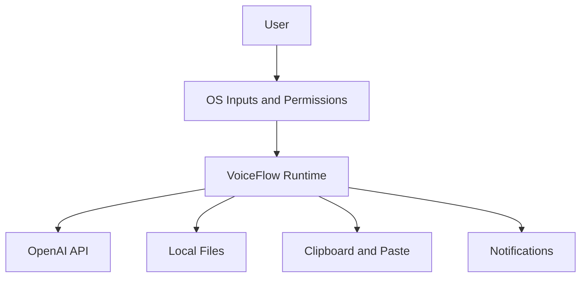

# VoiceFlow Threat Model

## Executive summary

VoiceFlow is a per-user local desktop client that captures microphone and optional system audio, sends audio and prompt context to OpenAI for transcription and cleanup, and then exposes resulting text through paste, notifications, logs, and optional transcript/recording files. The highest-risk areas are local credential and transcript exfiltration from persistent storage, disclosure of sensitive user content across OS-integrated surfaces like clipboard and notifications, and integrity/availability risks created by trusting the local workstation and OS session as the primary security boundary. Evidence anchors: `voiceflow/core/transcriber.py` (`Transcriber.client`, `Transcriber.transcribe`, `Transcriber.cleanup`), `voiceflow/core/app.py` (`paste_transcription`, `VoiceFlowApp._process_audio`, `main`), `voiceflow/core/meeting.py` (`MeetingSession._process_meeting`).

## Scope and assumptions

- In scope:
  - Runtime app entrypoints and operator tooling: `voiceflow.py`, `voiceflow/core/app.py`, `voiceflow/core/transcriber.py`, `voiceflow/core/audio.py`, `voiceflow/core/meeting.py`, `voiceflow/core/config.py`, `settings_gui.py`, `setup.py`, and platform integrations under `voiceflow/platform/`.
  - Local data handling for config, logs, recordings, meeting transcripts, clipboard, notifications, and OpenAI API usage.
- Out of scope:
  - Any future backend relay, shared sync, team administration, or centralized telemetry. You said those may come later but do not exist now.
  - Packaging, installer signing, and distribution-channel security beyond what is visible in `setup.py`.
  - Third-party service internals for OpenAI, `sounddevice`, `pynput`, `rumps`, `pystray`, and OS notification subsystems.
- Assumptions:
  - Deployment is per-user on local workstations, not as a multi-tenant service or shared server.
  - The app has no first-party authn/authz layer; access control is the logged-in OS session plus OS privacy prompts. Evidence: `voiceflow/core/app.py:746`, `voiceflow/platform/__init__.py:20`.
  - Dictated text and meeting transcripts should be treated as confidentiality-capable by default because users may choose to process business-sensitive content, even if some users only dictate low-sensitivity notes. Evidence: `voiceflow/core/meeting.py:483`, `settings_gui.py:347`.
  - OpenAI transport security is delegated to the SDK; HTTPS is assumed but not configured explicitly in this repo. Evidence: `voiceflow/core/transcriber.py:81`, `voiceflow/core/transcriber.py:149`.
- Open questions that would materially change ranking:
  - Whether managed enterprise endpoints and EDR/clipboard-history tooling are first-class target environments after launch.
  - Whether meeting mode will become enabled by default for broad user populations or remain an advanced opt-in feature.

## System model
### Primary components

- Desktop runtime shell: `voiceflow.py` and `voiceflow/core/app.py` choose macOS tray, Windows tray, or CLI fallback, then start the hotkey listener and recording pipeline.
- Audio capture layer: `voiceflow/core/audio.py` records microphone audio to temp WAV files; `voiceflow/core/meeting.py` records microphone plus optional system audio, chunks it, and writes outputs to disk.
- Transcription layer: `voiceflow/core/transcriber.py` loads the API key, sends audio to OpenAI Whisper, optionally sends transcript text to GPT cleanup, and returns final text.
- Local persistence layer: `voiceflow/core/config.py`, `settings_gui.py`, and `setup.py` read and write config, dictionary, and logs under `~/.voiceflow`; meeting mode also writes transcript artifacts.
- OS integration layer: platform services under `voiceflow/platform/` provide clipboard, notifications, tray, autostart, and system-audio interactions through `pbcopy`, `osascript`, `pyperclip`, `winotify`, and LaunchAgents.
- Operator tooling: `settings_gui.py` and `setup.py` are local administrative entrypoints that alter app configuration and autostart behavior.

### Data flows and trust boundaries

- User input devices and OS privacy prompts -> VoiceFlow runtime
  - Data: hotkey presses, microphone audio, optional system audio, user-selected settings.
  - Channel: local OS input APIs, `pynput`, `sounddevice`, platform-specific system audio capture.
  - Security guarantees: OS session access and platform privacy permissions only; no app-level auth or rate limiting.
  - Validation: minimal type/flow validation; settings values are mostly trusted once loaded from config/UI.
- VoiceFlow runtime -> OpenAI API
  - Data: API key, audio files, Whisper prompt, custom dictionary terms, cleanup prompt, raw transcript text.
  - Channel: OpenAI Python SDK network calls.
  - Security guarantees: assumed HTTPS/TLS via SDK; no repo-visible request signing beyond bearer credential.
  - Validation: no schema enforcement beyond SDK arguments; prompt and transcript content are forwarded largely as-is.
- VoiceFlow runtime -> Local filesystem
  - Data: config JSON, dictionary text, application logs, temporary WAVs, saved recordings, meeting transcripts, LaunchAgent plist/stdout/stderr paths.
  - Channel: local file I/O via `json.dump`, `write_text`, `NamedTemporaryFile`, `copy2`, `mkdir`.
  - Security guarantees: OS filesystem permissions and umask; no repo-visible encryption or integrity protection.
  - Validation: paths are mostly trusted from config or defaults; meeting output directory is operator-controlled.
- VoiceFlow runtime -> Clipboard and paste target
  - Data: final transcribed text.
  - Channel: global clipboard plus synthetic paste via `osascript` or `pynput`.
  - Security guarantees: same-user OS session trust; no origin check on receiving application.
  - Validation: text is copied as produced; no destination-aware filtering or content classification.
- VoiceFlow runtime -> Notification surfaces
  - Data: transcript previews, errors, meeting completion status.
  - Channel: macOS notifications via `osascript`, Windows toast notifications via `winotify` or log fallback.
  - Security guarantees: OS notification subsystem only; no privacy mode by default.
  - Validation: message content is truncated but otherwise trusted.

#### Diagram

## Assets and security objectives

| Asset | Why it matters | Security objective (C/I/A) |
| --- | --- | --- |
| OpenAI API key | Enables billable API access and could be reused outside the app if stolen | C, I |
| Raw audio recordings and meeting chunks | Can contain sensitive speech, meeting content, and identifiers before any user review | C |
| Raw and cleaned transcript text | May include confidential notes, credentials spoken aloud, or business discussions | C, I |
| Meeting transcript files | Durable artifact that may be shared, backed up, or indexed by other software | C, I |
| Config and prompt settings | Control destination paths, model behavior, prompt context, and autostart state | I |
| Logs and notification history | Persist operational context and may unintentionally retain transcript excerpts | C, I |
| Clipboard contents | Shared OS surface that other apps and clipboard managers can access | C, I |
| Availability of transcription workflow and API budget | Users rely on fast dictation; misuse can create user-visible outages or unexpected cost | A |

## Attacker model
### Capabilities

- Malicious or overly privileged local software running in the same user session can read user-accessible files, monitor clipboard/history, observe notifications, or modify local config.
- Another local user on a shared or weakly permissioned system may read files under `~/.voiceflow` if directory/file permissions are too broad.
- A user can unintentionally disclose sensitive data to OpenAI by dictating confidential content, enabling meeting mode, or placing sensitive context in prompt fields.
- A compromise of the local workstation or backup/sync tooling can exfiltrate durable artifacts more easily than transient process memory.

### Non-capabilities

- No internet-originating attacker can directly send requests into VoiceFlow because the repo exposes no inbound network listener or API endpoint.
- There is no tenant boundary, user-account system, or remote admin plane in the current codebase, so cross-tenant and auth-bypass classes do not apply today.
- The reviewed code does not show shell-string execution of attacker-controlled input, so classic remote command injection is not a primary risk in the current local-only design.

## Entry points and attack surfaces

| Surface | How reached | Trust boundary | Notes | Evidence (repo path / symbol) |
| --- | --- | --- | --- | --- |
| Main app startup | Local execution of `python voiceflow.py` or `python -m voiceflow` | User/OS -> runtime | Loads config, checks dependencies, starts hotkey and tray flow | `voiceflow.py`, `voiceflow/core/app.py:main` |
| Settings GUI | Local user launches `settings_gui.py` or tray action | User/OS -> runtime -> filesystem | Reads and rewrites config and dictionary | `settings_gui.py:SettingsApp._load_config`, `SettingsApp._on_save` |
| Setup wizard | Local user launches `setup.py` | User/OS -> runtime -> filesystem | Collects API key, writes config, creates launcher and optional LaunchAgent | `setup.py:configure_api_key`, `main`, `create_launchd_plist` |
| Hotkey listener | Global keyboard events | OS input -> runtime | Starts/stops recording without app-level auth | `voiceflow/core/app.py:HotkeyManager` |
| Microphone recording | `sounddevice.InputStream` | Device/OS -> runtime | Captures raw mic audio to temp WAVs | `voiceflow/core/audio.py:AudioRecorder.start`, `AudioRecorder.stop` |
| Meeting mode recording | Tray menu and audio callbacks | User/OS -> runtime -> filesystem | Captures mic and optional system audio, chunks and writes files | `voiceflow/core/meeting.py:MeetingRecorder.start`, `MeetingSession._process_meeting` |
| OpenAI transcription and cleanup | Internal call after capture | Runtime -> external service | Sends audio, prompts, and transcript content off-device | `voiceflow/core/transcriber.py:Transcriber.transcribe`, `Transcriber.cleanup` |
| Clipboard paste flow | After transcription | Runtime -> OS clipboard/paste target | Copies text globally before paste simulation | `voiceflow/core/app.py:paste_transcription`, `voiceflow/platform/macos/clipboard.py:MacOSClipboard`, `voiceflow/platform/windows/clipboard.py:WindowsClipboard` |
| Notifications | After transcription/errors | Runtime -> OS notifications | Shows transcript preview by default; Windows fallback logs body | `voiceflow/core/app.py:VoiceFlowApp._process_audio`, `voiceflow/platform/windows/notifications.py:WindowsNotifications.send` |

## Top abuse paths

1. Attacker steals the OpenAI API key by reading `~/.voiceflow/config.json` written by setup or settings, then uses the key externally to generate cost and impersonate VoiceFlow traffic.
2. Attacker or endpoint software harvests transcript content from `~/.voiceflow/voiceflow.log`, where raw transcript, cleaned text, and pasted preview content are persisted after normal use.
3. A same-session process or clipboard-history tool reads dictated text from the global clipboard after `paste_transcription()` copies it, especially when paste fails and the content remains available.
4. Sensitive transcript previews appear in notification history or on screen, exposing content to shoulder-surfing, screen recording, or Windows log fallback collection.
5. Meeting mode writes durable transcript files and chunked audio under default or configured output paths, where sync/backup software or other local users can collect the content later.
6. A malicious local process modifies config or prompt fields to redirect outputs, alter model prompts, or degrade integrity of pasted text without needing to compromise a remote service.
7. A compromised workstation reuses the locally stored API key and local artifacts together, turning a local user compromise into both confidentiality loss and sustained API-cost abuse.

## Threat model table

| Threat ID | Threat source | Prerequisites | Threat action | Impact | Impacted assets | Existing controls (evidence) | Gaps | Recommended mitigations | Detection ideas | Likelihood | Impact severity | Priority |
| --- | --- | --- | --- | --- | --- | --- | --- | --- | --- | --- | --- | --- |
| TM-001 | Malicious local process or local user | Attacker can read files under the user's profile or synced backup copies | Read plaintext API key from config and replay it outside the app | External API abuse, cost exposure, loss of credential confidentiality | OpenAI API key, API budget | Environment variable fallback exists in `voiceflow/core/transcriber.py:Transcriber.client` | `api_key` is written and read from config by default in `voiceflow/core/config.py:save_config`, `settings_gui.py:SettingsApp._on_save`, `setup.py:main` | Move key storage to OS-backed secure storage, migrate legacy config keys, and remove plaintext persistence | Warn on legacy key migration, log credential-source changes without logging secrets, track abnormal API spend outside app | high | high | high |
| TM-002 | Malicious local process, backup/sync agent, shared-device user | Attacker can read `~/.voiceflow` or copied backups | Recover transcript content from logs, meeting transcript files, and recordings | Confidential speech and meeting content disclosure | Transcript text, recordings, meeting outputs, logs | Logging exists for troubleshooting in `voiceflow/core/config.py:log`; meeting mode stores outputs intentionally in `voiceflow/core/meeting.py:MeetingSession._process_meeting` | Logs include transcript bodies and file writes do not enforce restrictive permissions | Remove content-bearing log lines, add secure file-write helpers, and default meeting outputs to owner-only permissions | Add startup checks that flag weak file permissions and optional audit events when meeting outputs are saved | high | high | high |
| TM-003 | Same-session app, clipboard manager, shoulder-surfer | User enables auto-paste or paste failure occurs; attacker can observe clipboard or screen | Read final transcript from clipboard or notification preview | Short-lived but common disclosure of dictated text | Clipboard contents, transcript text, notification history | Transcript preview is truncated and paste failure is surfaced to the user in `voiceflow/core/app.py:paste_transcription` | Clipboard is global, preview text is enabled by default, Windows fallback can log notification bodies | Make notifications status-only by default, add optional clipboard clearing after successful paste, and document the privacy tradeoff in settings | Add a privacy mode metric/config flag and log only that preview mode is enabled, not the content itself | high | medium | high |
| TM-004 | Malicious local software modifying app state | Attacker can edit config or prompt settings within the user's profile | Alter prompts, output directory, or runtime behavior to change transcript integrity or redirect artifacts | Integrity loss of pasted or saved content; stealthy exfiltration through redirected outputs | Config, prompts, transcript files | Config is centralized in `voiceflow/core/config.py`; output path selection is explicit in `voiceflow/core/meeting.py:MeetingSession._process_meeting` | No integrity protection on config; prompt fields and output paths are trusted as local operator input | Validate paths before write, add secure defaults, show effective output locations in UI, and separate secret storage from editable config | Log config-file modifications at startup with path only; optionally checksum and warn on unexpected changes | medium | medium | medium |
| TM-005 | User mistake, sensitive environment, or compromised endpoint | User dictates confidential content or enables meeting capture on a sensitive endpoint | Send sensitive audio, prompts, and transcripts to OpenAI and retain durable local copies | Privacy loss, compliance issues, unintentional third-party disclosure | Audio, transcript text, prompts, meeting transcripts | Cost warning exists for meeting mode in config/UI; users explicitly enable custom prompts in `settings_gui.py` | No data-classification guardrail, privacy mode, or clear warning that prompts and transcript content go off-device | Add clear privacy notices near prompt and meeting settings, offer a reduced-retention mode, and make transcript previews opt-in | Detect meeting-mode usage and privacy-mode state for local diagnostics without retaining content | medium | high | medium |
| TM-006 | Compromised workstation or aggressive automation | Attacker can trigger recordings or repeatedly reuse the stolen key | Force repeated transcriptions to exhaust API spend or disrupt user workflow | Availability loss and unexpected cost | API budget, user productivity | `max_recording_seconds` limits single-recording duration in config; meeting mode chunks audio in `voiceflow/core/meeting.py` | No local abuse throttling, no per-session usage cap, and stolen key can be reused externally | Add optional local usage budgets, prominent recent-usage display, and rotate/revoke guidance when suspicious spend is detected | Track per-session transcription count and estimated local cost without recording content | medium | medium | medium |

## Criticality calibration

- `critical` for this repo means a threat that breaks the primary workstation trust boundary in a way that enables broad extraction or misuse of sensitive content or credentials with little user awareness.
  - Examples:
    - plaintext API key theft from config enabling external reuse
    - bulk recovery of meeting recordings and transcripts from weakly protected local storage
    - future backend relay compromise, if later added, that exposes multiple users at once
- `high` means likely confidentiality or integrity loss for a single user's content across common local surfaces or backups, even without full machine compromise.
  - Examples:
    - transcript body leakage to logs
    - transcript previews exposed through notifications or clipboard history
    - durable meeting transcript outputs written with permissive file defaults
- `medium` means realistic abuse with narrower prerequisites or more limited blast radius, usually requiring same-user access or explicit feature use.
  - Examples:
    - config tampering to redirect outputs or alter prompts
    - API-cost exhaustion from a stolen key or repeated forced recordings
    - privacy loss from optional meeting capture in sensitive environments
- `low` means low-sensitivity leaks or operational issues that need unusual preconditions or have modest impact in the current local-only deployment.
  - Examples:
    - autostart stdout/stderr surfaces retaining low-value operational data
    - fallback UX messages disclosing non-sensitive state
    - device-status logs that reveal local hardware metadata but not transcript content

## Focus paths for security review

| Path | Why it matters | Related Threat IDs |
| --- | --- | --- |
| `voiceflow/core/transcriber.py` | Defines the external API boundary, credential loading, prompt forwarding, and transcript logging behavior | TM-001, TM-002, TM-005 |
| `voiceflow/core/config.py` | Central store for config, logs, and local file paths; drives default persistence model | TM-001, TM-002, TM-004 |
| `voiceflow/core/app.py` | Orchestrates hotkey flow, paste behavior, notifications, and recording persistence | TM-002, TM-003, TM-006 |
| `voiceflow/core/meeting.py` | Handles long-lived capture, chunk storage, transcript output, and higher-sensitivity meeting content | TM-002, TM-004, TM-005 |
| `voiceflow/core/audio.py` | Writes temporary raw audio artifacts and defines capture lifecycle | TM-002 |
| `settings_gui.py` | Local administrative surface that rewrites config, prompt settings, and output destinations | TM-001, TM-004, TM-005 |
| `setup.py` | Bootstraps secrets, autostart, helper scripts, and local persistence defaults | TM-001, TM-002 |
| `voiceflow/platform/macos/clipboard.py` | macOS paste path across the global clipboard and synthetic keystrokes | TM-003 |
| `voiceflow/platform/windows/notifications.py` | Windows notification fallback can persist message bodies to logs | TM-002, TM-003 |
| `voiceflow/platform/macos/notifications.py` | macOS notification surface exposes transcript previews to OS-managed history/display | TM-003 |

## Quality check

- Entry points covered: startup, settings, setup, hotkey recording, meeting mode, OpenAI calls, clipboard, and notifications.
- Trust boundaries represented in threats: user/OS -> runtime, runtime -> filesystem, runtime -> OpenAI, runtime -> clipboard/paste target, runtime -> notifications.
- Runtime vs dev separation: this model focuses on runtime and operator tooling; future backend/distribution work is explicitly out of scope.
- User clarifications reflected: per-user local deployment is assumed, future backend is out of scope, and data sensitivity is treated as optional per user but confidentiality-capable by default.
- Assumptions and open questions are explicit in the scope section.

